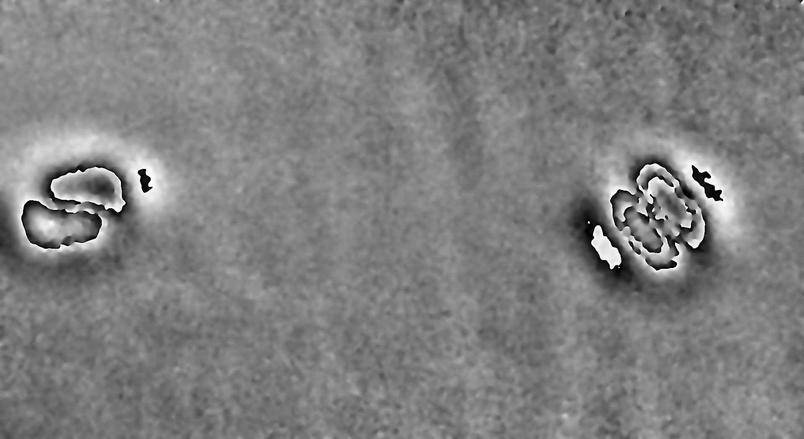
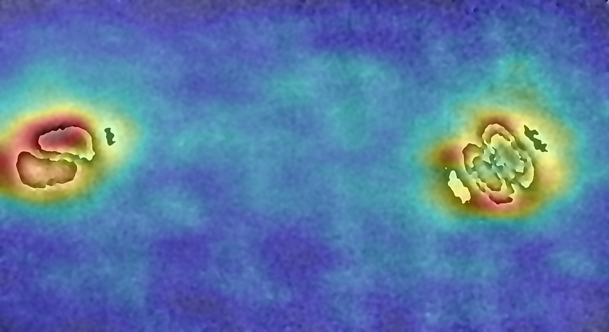
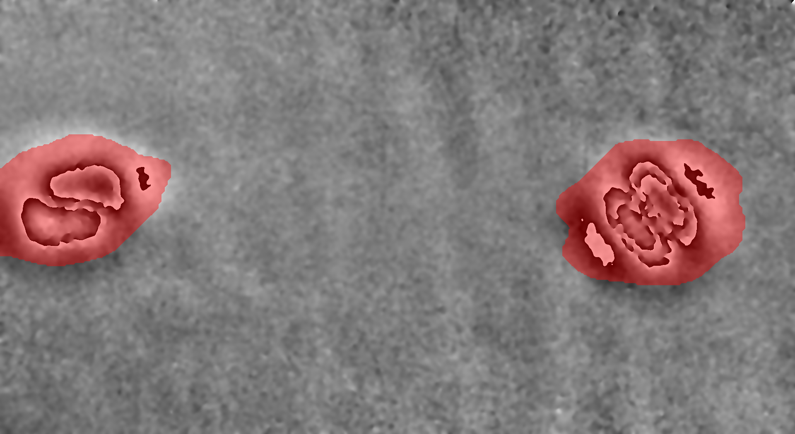
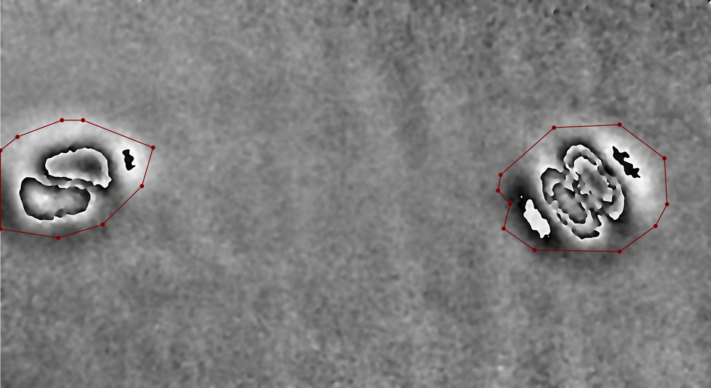
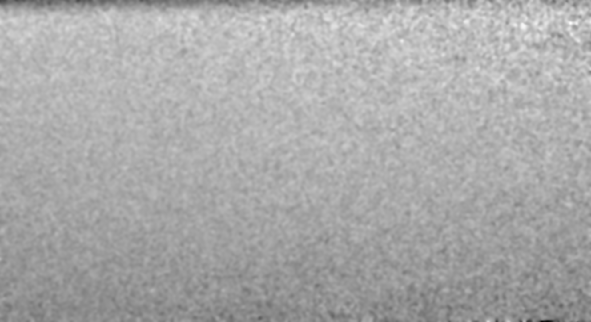
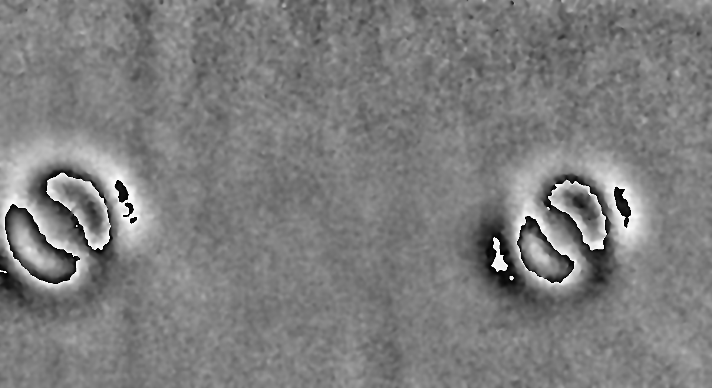
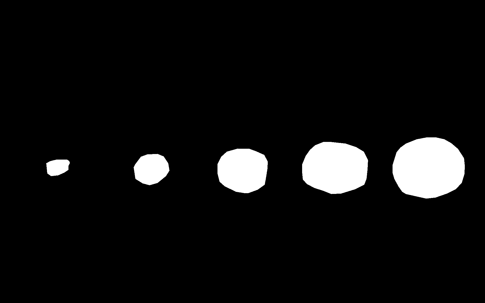

# Revisiting Reverse Distillation – Extended and Refactored Implementation

This repository builds upon the official RD++ implementation released with the CVPR 2023 paper “Revisiting Reverse Distillation for Anomaly Detection.”

The original project structure has been **refactored and extended** to improve maintainability, configurability and output analysis.

[](https://openaccess.thecvf.com/content/CVPR2023/papers/Tien_Revisiting_Reverse_Distillation_for_Anomaly_Detection_CVPR_2023_paper.pdf) [](https://github.com/tientrandinh/Revisiting-Reverse-Distillation)


## Features

* Unsupervised anomaly detection using Revisiting Reverse Distillation
* Training on normal samples only
* Unified CLI with YAML-based configuration
* Image-level predictions and confusion case analysis
* Pixel-level heatmaps, binary mask overlays and LabelMe-compatible polygon annotations


## Demo

Example results on shearography images showing pixel-level anomaly detection outputs. Image rights: Plassmann et al., https://zenodo.org/records/17631257

<table>
  <tr>
    <td align="left" style="padding-right:40px;">
      <br>
      <b>Input</b>
    </td>
    <td align="left" style="padding-right:40px;">
      <br>
      <b>Heatmap</b>
    </td>
    <td align="left" style="padding-right:40px;">
      <br>
      <b>Binary Mask</b>
    </td>
    <td align="left">
      <br>
      <b>Polygon Annotation</b>
    </td>
  </tr>
</table>


## Table of Contents

* [Installation](#installation)
* [Project Structure](#project-structure)
* [Dataset Structure](#dataset-structure)
* [Configuration](#configuration)
* [CLI Usage](#cli-usage)
* [License](#license)


## Installation

### Requirements

- Python 3.10 or newer (tested with Python 3.10.12 and Python 3.12)
- `pip` and `venv`
- Recommended: CUDA-enabled GPU (>4 GB VRAM for larger backbones; 
  tested on NVIDIA Quadro P2000 Mobile and RTX 3060 Ti)

### Create and activate a virtual environment

```bash
python3 -m venv rdpp_venv
source rdpp_venv/bin/activate
```

### Install dependencies

```bash
pip install -r requirements.txt
```

### Install PyTorch

PyTorch is not included in `requirements.txt` and must be installed separately.

**CPU-only:**

```bash
pip install torch==1.12.1 torchvision==0.13.1
```

**NVIDIA GPU (CUDA 11.3):**

```bash
pip install torch==1.12.1 torchvision==0.13.1 --index-url https://download.pytorch.org/whl/cu113
```

Tested with:
- torch 1.12.1
- torchvision 0.13.1
- CUDA 11.3


## Project Structure

```text
rdpp/
├── src/
│   ├── scripts/          # CLI entry points
│   │   ├── train.py      # Starts the training pipeline, trains the model and saves a checkpoint
│   │   ├── test.py       # Loads a trained checkpoint and evaluates the model using ground truth
│   │   └── deploy.py     # Loads a trained checkpoint and applies the model to new data without ground truth
│   ├── training/         # Training pipeline
│   ├── testing/          # Testing pipeline
│   ├── deployment/       # Deployment pipeline
│   ├── inference/        # Inference and anomaly maps
│   ├── evaluation/       # Evaluation metrics
│   ├── postprocessing/   # Image- and pixel-level output processing
│   ├── data/             # Dataset handling
│   └── utils/            # Shared utilities
├── configs/              # YAML configurations
├── datasets/             # Datasets
├── output/               # Generated outputs from training, testing, and deployment runs
├── assets/               # Demo images used in the README
├── requirements.txt
└── README.md
```


## Dataset Structure

Datasets are stored in datasets/ and follow a standard anomaly detection layout
with separate train, test, and ground_truth directories. Training is performed
using normal samples only.

Ground-truth annotations are provided as binary masks (white = anomaly, black = normal)
and must share the same filenames as their corresponding faulty test images. The
faulty/ and ground_truth/ directories may contain defect-specific subfolders.

If annotations are available in LabelMe format (JSON), they can be converted into
binary masks using the labelme_to_mask.py script located in the scripts/ directory.

Depending on the execution mode (training, testing, or deployment), different parts
of the dataset are required:

* **Training:** train, test and ground-truth data
* **Testing:** test and ground-truth data
* **Deployment:** test data only

### Example Dataset Directory Structure
```text
datasets/
  └── <category_name>/
      ├── train/
      │   └── good/
      ├── test/
      │   ├── good/
      │   └── faulty/
      │       ├── <defect_type_1>/  (optional)
      │       ├── ...
      │       └── <defect_type_n>/  (optional)
      └── ground_truth/
          └── faulty/
              ├── <defect_type_1>/  (optional)
              ├── ...
              └── <defect_type_n>/  (optional)
```

### Sample Images and Ground-Truth Masks
Representative samples of normal images, faulty images and corresponding
ground-truth masks. Image rights: Tenta Vision GmbH

<table>
  <tr>
    <td align="left" style="padding-right:5px;">
      <br>
      <b>Normal Image (Good)</b>
    </td>
    <td align="left" style="padding-right:5px;">
      <br>
      <b>Faulty Image</b>
    </td>
    <td align="left">
      <br>
      <b>Ground-Truth Mask</b>
    </td>
  </tr>
</table>


## Configuration

All pipelines are configured via YAML files in `configs/`, which should be
reviewed and adapted before running training, testing or deployment.
Command-line arguments override the corresponding YAML settings.

Separate YAML configuration files are used for training, testing, and deployment:

* `config_training.yaml`
* `config_testing.yaml`
* `config_deployment.yaml`


## CLI Usage

All scripts are executed as Python modules.

### Training

Executes the training pipeline on normal samples of a dataset category.

```bash
python3 -m src.scripts.train
```

**Arguments:**

* `--dataset <DATASET_PATH>`  
  Override dataset path (e.g. `./datasets/shearography`)

* `--config <CONFIG>`
  Override training config filename (relative to `configs/`, e.g. `config_training.yaml`)

* `--batch_size <BATCH_SIZE>`  
  Override training batch size

* `--epochs <EPOCHS>`  
  Override number of training epochs

* `--save_folder <SAVE_FOLDER_PATH>`  
  Override output directory for training results (e.g. `./output` or `/home/user/experiments`)

### Testing

Executes the evaluation pipeline on unseen data of a dataset category
with ground-truth annotations using a trained model.

```bash
python3 -m src.scripts.test
```

**Arguments:**

* `--dataset <DATASET_PATH>`  
  Override dataset path (e.g. `./datasets/shearography`)

* `--config <CONFIG>`  
  Override testing config filename (relative to `configs/`, e.g. `config_testing.yaml`)

* `--checkpoint_path <CHECKPOINT_PATH>`  
  Override path to trained model checkpoint (e.g. `./output/training/2026-03-30_16-00-21/shearography/best_model_resnet34_shearography.pth`)

* `--save_folder <SAVE_FOLDER_PATH>`  
  Override output directory for testing results (e.g. `./output` or `/home/user/experiments`)
  
### Deployment

Executes the inference pipeline on unseen data of a dataset category without
ground-truth annotations using a trained model.
This pipeline is intended for real-world deployment settings.

```bash
python3 -m src.scripts.deploy
```

**Arguments:**

* `--dataset <DATASET_PATH>`  
  Override dataset path for deployment (e.g. `./datasets/shearography`)

* `--config <CONFIG>`  
  Override deployment config filename (relative to `configs/`, e.g. `config_deployment.yaml`)

* `--checkpoint_path <CHECKPOINT_PATH>`  
  Override path to trained model checkpoint (e.g. `./output/.../best_model_resnet34_shearography.pth`)

* `--save_folder <SAVE_FOLDER_PATH>`  
  Override output directory for deployment results (e.g. `./output` or `/home/user/experiments`)

### Help

Each script provides a detailed help message:

```bash
python3 -m src.scripts.<script_name> --help
```


## Threshold Tuning

Image- and pixel-level results depend on the configured thresholds.

Key parameters:
- `image_threshold`, `image_quantile` (image-level prediction)
- `pixel_threshold`, `min_region_area` (pixel-level output)

These values are dataset-dependent and may need adjustment for optimal results.


## License

This project follows the license of the original RDPP implementation.
See the `LICENSE` file for details.